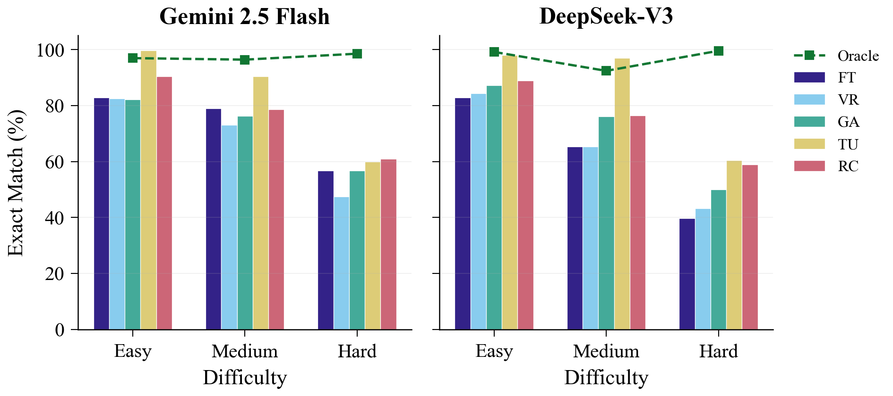
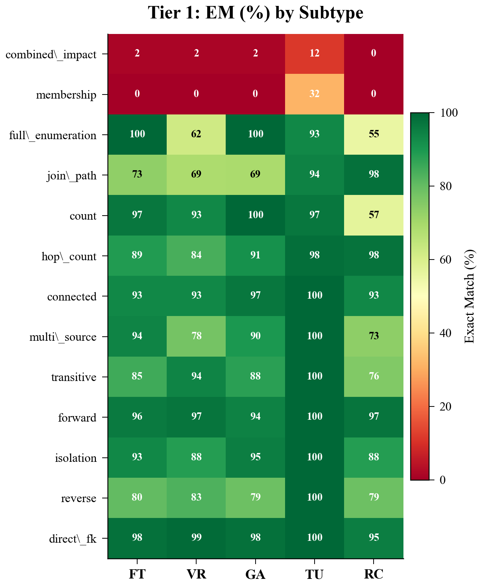
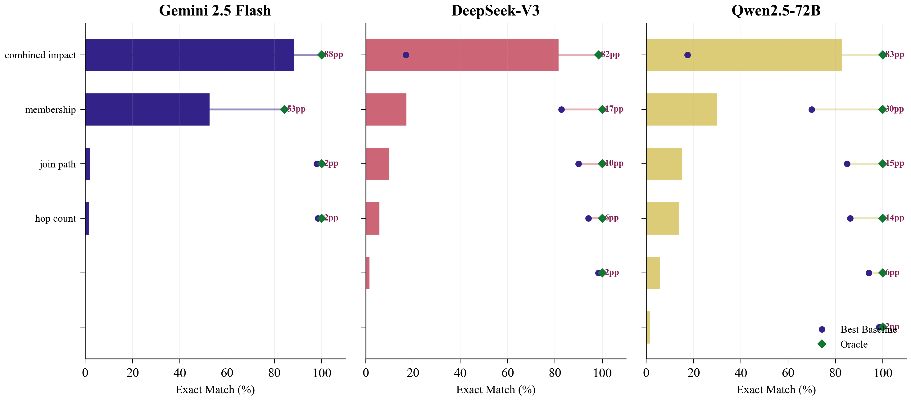

# DW-Bench: Benchmarking LLMs on Data Warehouse Graph Topology Reasoning

[](LICENSE)
[](https://python.org)
[](datasets/)
[]()
[]()

**DW-Bench** is the first benchmark for evaluating whether Large Language Models can reason about the *graph topology* of data warehouse schemas — foreign key paths, data lineage chains, connected components, and row-level provenance — rather than generating SQL.

---

## Main Results

### Tier 1: Schema-Level Reasoning (1,046 questions, 5 datasets)

| Baseline | Gemini 2.5 Flash | DeepSeek-V3 |
|:---|:---:|:---:|
| Flat Text (FT) | 76.8 ± 2.4 | 69.7 ± 2.8 |
| Vector-RAG (VR) | 73.2 ± 2.6 | 71.2 ± 2.8 |
| Graph-Aug (GA) | 75.7 ± 2.5 | 77.0 ± 2.6 |
| **Tool-Use (TU)** | **89.3 ± 1.9** | **90.4 ± 1.7** |
| ReAct-Code (RC) | 81.4 ± 2.4 | 79.4 ± 2.4 |
| Oracle | 97.0 ± 1.0 | 97.2 ± 1.0 |

> Micro-EM (%) with 95% bootstrap CIs (2000 resamples).

### Key Figures

<p align="center">
  
</p>

**EM by difficulty level** across three models (Gemini, DeepSeek-V3, Qwen2.5-72B). All baselines plateau on hard questions (~40-60%) while Oracle (dashed) achieves ≥97%.

<p align="center">
  
</p>

**Per-subtype EM heatmap** (darker red = lower). `combined_impact` (top row) is universally hard (2-17% EM); `membership` shows model-dependent gaps.

<p align="center">
  
</p>

**Unsolved subtypes** (Oracle minus best baseline). `combined_impact` retains an 83-88 pp gap across all three models; 9 of 13 subtypes are effectively solved.

### Obfuscation (Contamination Control)

| Baseline | Gemini Δ | DeepSeek Δ |
|:---|:---:|:---:|
| Flat Text | −14.9 | −27.8 |
| Vector-RAG | −26.0 | −31.7 |
| Graph-Aug | −27.9 | −24.3 |
| **Tool-Use** | **−3.4** | **−4.2** |
| ReAct-Code | −7.6 | +0.6 |

> Tool-Use is nearly obfuscation-invariant: tools operate on topology, not memorized names.

---

## Quick Start

### 1. Install

```bash
git clone https://github.com/AJamal27891/dw-bench.git
cd dw-bench
pip install -r requirements.txt
```

### 2. Verify Pipeline

```bash
# Quick check: runs Oracle on TPC-DS (needs API endpoint)
python run.py --api-base https://generativelanguage.googleapis.com/v1beta/openai \
              --model gemini-2.5-flash --verify
```

### 3. Run Full Evaluation

```bash
# Tier 1: All baselines × all datasets (Gemini)
python run.py \
  --api-base https://generativelanguage.googleapis.com/v1beta/openai \
  --model gemini-2.5-flash

# Tier 1: Single baseline × single dataset
python run.py --api-base ... --model ... --baseline tool_use --dataset tpc-ds

# Tier 1: Obfuscated condition
python run.py --api-base ... --model ... --condition obfuscated

# Tier 2: Value-level evaluation
python run.py --api-base ... --model ... --tier 2

# DeepSeek
python run.py \
  --api-base https://api.deepseek.com/v1 \
  --model deepseek-chat

# Local model (LM Studio, Ollama, vLLM)
python run.py \
  --api-base http://localhost:1234/v1 \
  --model your-model-name
```

### 4. View Results

```bash
python view_results.py              # Summary tables
python integrity_check.py           # Validate result files
```

> **Tip:** Set `GOOGLE_API_KEY` or `DEEPSEEK_API_KEY` in a `.env` file; `run.py` reads them automatically.

---

## Project Structure

```
dw-bench/
├── run.py                          # Unified evaluation runner
├── view_results.py                 # Results viewer
├── integrity_check.py              # Result validator
├── requirements.txt
│
├── datasets/                       # Schema graphs + QA pairs
│   ├── adventureworks/             #   102 tables, 136 FK, 39 lineage
│   ├── tpc-ds/                     #    24 tables, 70 FK
│   ├── tpc-di/                     #    35 tables, 29 FK, 21 lineage
│   ├── omop_cdm/                   #    37 tables, 74 FK, 21 lineage
│   └── syn_logistics/              #    64 tables, 96 FK, 35 lineage
│
├── evaluation/                     # Evaluation pipeline
│   ├── evaluate.py                 #   Main evaluation harness
│   ├── metrics.py                  #   Scoring (EM, F1, path validation)
│   ├── baselines/                  #   Baseline implementations
│   │   ├── flat_text.py            #     Full schema as text
│   │   ├── vector_rag.py           #     FAISS embedding retrieval
│   │   ├── graph_aug.py            #     BFS graph neighborhoods
│   │   ├── tool_use.py             #     Agentic graph tools (9 tools, 3 calls)
│   │   ├── react_code.py           #     Python/NetworkX code gen (5 rounds)
│   │   ├── oracle.py               #     Gold algorithmic output
│   │   └── *_v2.py                 #     Tier 2 (value-level) variants
│   └── results/                    #   Evaluation outputs (JSON)
│
├── scripts/                        # Data pipeline
│   ├── generate_qa.py              #   Question generation
│   ├── obfuscate_schema.py         #   Obfuscation protocol
│   └── ...
│
├── paper/                          # Conference paper
└── paper_journal/                  # Journal paper (Springer)
```

---

## Benchmark Design

### Datasets (262 tables, 521 edges)

| Dataset | Domain | Tables | FK | Lineage | Tier 1 Qs | Tier 2 Qs | Silos |
|:--|:--|:--:|:--:|:--:|:--:|:--:|:--:|
| AdventureWorks | Retail/HR | 102 | 136 | 39 | 208 | 520 | 11 |
| TPC-DS | Analytics | 24 | 70 | 0 | 127 | — | 1 |
| TPC-DI | ETL | 35 | 29 | 21 | 181 | — | 2 |
| OMOP CDM | Healthcare | 37 | 74 | 21 | 158 | — | 3 |
| Syn-Logistics | Supply Chain | 64 | 96 | 35 | 372 | 433 | 5 |
| **Total** | | **262** | **405** | **116** | **1,046** | **953** | |

### Question Taxonomy (13 subtypes, 3 difficulty levels)

| Category | Subtype | Difficulty | Description |
|:--|:--|:--|:--|
| **Lineage** | `forward` | Easy | Direct lineage targets |
| | `reverse` | Easy | Source tables for a DW table |
| | `transitive` | Hard | Multi-hop lineage chains |
| | `combined_impact` | Hard | Lineage + FK dependents |
| | `multi_source` | Medium | Tables with 3+ sources |
| **Route** | `direct_fk` | Easy | FK adjacency check |
| | `join_path` | Medium | FK shortest path |
| | `hop_count` | Medium | Path length |
| **Silo** | `count` | Easy | Number of components |
| | `membership` | Hard | Which component contains X? |
| | `isolation` | Medium | Is table X isolated? |
| | `connected` | Medium | Are X and Y connected? |
| | `full_enumeration` | Hard | List all tables in silo |

---

## Six Baselines

| Baseline | Context | Approach |
|:--|:--|:--|
| **Flat Text (FT)** | Full schema as text | Complete graph, maximal context |
| **Vector RAG (VR)** | Top-k retrieved chunks | Sentence-BERT + FAISS (k=15) |
| **Graph-Aug (GA)** | BFS neighborhood | 3-hop subgraph from mentioned tables |
| **Tool-Use (TU)** | Schema + 9 graph tools | Agentic: multi-turn tool calling (3 calls) |
| **ReAct-Code (RC)** | Schema + Python exec | Code generation on NetworkX graph (5 rounds) |
| **Oracle** | Gold algorithmic output | Upper bound (perfect retrieval) |

---

## Evaluation Conditions

- **Original** — Real table names (tests reasoning + memorization)
- **Obfuscated** — Names replaced with `Table_A`, `Table_B`, ... (tests pure structural reasoning)
- **Extended** — Hard + medium questions only (harder subset)

---

## Extending DW-Bench

### Adding a New Model

```bash
python run.py --api-base YOUR_URL --model YOUR_MODEL --condition all
python integrity_check.py
```

### Adding a New Dataset

1. Create `datasets/your_dataset/schema_graph.pt` (PyG HeteroData)
2. Run `python scripts/generate_qa.py --dataset your_dataset`
3. Run `python scripts/obfuscate_schema.py --dataset your_dataset`
4. Evaluate: `python run.py --api-base ... --model ... --dataset your_dataset`

---

## Citation

```bibtex
@inproceedings{ahmed2026dwbench,
  title     = {DW-Bench: Benchmarking LLMs on Data Warehouse Graph Topology Reasoning},
  author    = {Ahmed, Ahmed G.A.H.},
  booktitle = {Advances in Neural Information Processing Systems (NeurIPS)
               Datasets and Benchmarks Track},
  year      = {2026},
  url       = {https://github.com/AJamal27891/dw-bench}
}
```

---

## License

MIT License. See [LICENSE](LICENSE) for details.
