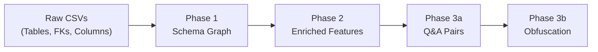

# DW-Bench Data Pipeline: Complete Technical Documentation

## Overview

DW-Bench converts raw data warehouse metadata (CSV/JSON) into graph-based Q&A benchmark data through a three-phase pipeline.



---

## Datasets

| Dataset | Domain | Tables | FK | Lineage | Silos |
|---------|--------|--------|-----|---------|-------|
| **AdventureWorks** | Retail/Manufacturing | 102 (71 OLTP + 31 DW) | 136 | 39 | 11 |
| **TPC-DS** | Retail Analytics | 24 (7 fact + 17 dim) | 70 | 0 | 1 |
| **TPC-DI** | Brokerage ETL | 35 (17 DW + 18 source) | 29 | 21 | 5 |
| **OMOP CDM** | Healthcare | 37 | 74 | 21 | 3 |

---

## Phase 1: Raw CSVs → Schema Graph

**Script:** [convert_schema_graph.py](file:///d:/job_assignments/PyG_Opensource_contribution/dw-bench/scripts/convert_schema_graph.py)

### Input CSVs (per dataset)
- `*_Tables.csv` — `TABLE_SCHEMA, TABLE_NAME, TABLE_TYPE`
- `*_Relationships.csv` — `ForeignKeyName, ChildTable, ChildColumn, ParentTable, ParentColumn`
- `*_Columns.csv` — `TABLE_SCHEMA, TABLE_NAME, COLUMN_NAME, DATA_TYPE, IS_NULLABLE`
- `lineage_edges.json` — `{source, target, evidence}`

### Process
1. Read table and FK metadata from CSVs
2. Build directed graph (NetworkX): node = table, edges = FK + lineage
3. Compute **6 structural features** per node: `in_degree, out_degree, degree_centrality, betweenness_centrality, pagerank, silo_id`
4. Package into PyG `HeteroData` with edge types `fk_to` and `derived_from`

### Output: `schema_graph.pt`
```python
data['table'].x           # [N, 6] structural features
data['table'].table_names  # ['OLTP.Sales.Customer', ..., 'DW.dbo.FactInternetSales']
data['table', 'fk_to', 'table'].edge_index           # [2, FK_count]
data['table', 'derived_from', 'table'].edge_index     # [2, lineage_count]
```

---

## Phase 2: Structural Features → Enriched Features

**Script:** [compute_features.py](file:///d:/job_assignments/PyG_Opensource_contribution/dw-bench/scripts/compute_features.py)

### Process
1. **Synthesize DDL** — construct `CREATE TABLE` SQL from column CSVs
2. **Embed DDL** — encode each DDL string via `all-MiniLM-L6-v2` (384-dim)
3. **Concatenate** — `[DDL_embed(384) | structural(6)] = 390-dim` per node

### Output: `enriched_schema_graph.pt`
```python
data['table'].x  # [N, 390]
# [0:384]  = DDL semantic embedding
# [384:390] = structural features
```

---

## Phase 3a: Schema Graph → Q&A Pairs

**Script:** [generate_qa.py](file:///d:/job_assignments/PyG_Opensource_contribution/dw-bench/scripts/generate_qa.py)

All answers derived programmatically from graph traversal — **508/508 validated**.

### 13 Question Subtypes

#### Lineage Impact (119 Qs — AdventureWorks + TPC-DI only)
| Subtype | Difficulty | Method | Example |
|---------|-----------|--------|---------|
| `forward` | Easy | Outgoing lineage edges | *"Which DW tables derive from SRC.FINWIRE_FIN?"* → `["Financial"]` |
| `reverse` | Easy | Incoming lineage edges | *"What sources feed DimBroker?"* → `["SRC.HR"]` |
| `transitive` | **Hard** | Cycle-safe DFS | *"If SRC.FINWIRE_CMP changes, what's transitively affected?"* → `["DimCompany","DimSecurity"]` |
| `combined_impact` | **Hard** | Lineage DFS + FK reverse | *"What's affected via lineage OR FK dependency?"* |
| `multi_source` | **Hard** | Reverse lineage (≥3 sources) | *"List ALL sources feeding into DimProduct"* |

#### Silo Detection (44 Qs)
| Subtype | Difficulty | Method |
|---------|-----------|--------|
| `count` | Easy | Component count |
| `membership` | Medium | Component members |
| `isolation` | Medium | Cross-component pair → `false` |
| `connected` | Easy | Same-component pair → `true` |
| `full_enumeration` | **Hard** | List ALL tables in largest silo |
| `no_path` | **Hard** | Confirm no join path across silos |

#### Schema Routing (345 Qs)
| Subtype | Difficulty | Method |
|---------|-----------|--------|
| `join_path` | Easy/Med/**Hard** | BFS shortest path (hard = 4+ hops) |
| `hop_count` | Medium | BFS path length |
| `direct_fk` | Easy | Direct edge check |

### Distribution

| Metric | Value |
|--------|-------|
| **Total** | **508** |
| Easy / Medium / Hard | 282 (55%) / 140 (28%) / 86 (17%) |
| By dataset | AW: 204, TPC-DS: 122, TPC-DI: 182 |

---

## Phase 3b: Obfuscation

**Script:** [obfuscate_schema.py](file:///d:/job_assignments/PyG_Opensource_contribution/dw-bench/scripts/obfuscate_schema.py)

Scrambles table names (`DimCustomer → Table_A7`) to force structural reasoning.

### Outputs per dataset
| File | Description |
|------|-------------|
| `obfuscated_schema_graph.pt` | Graph with scrambled names, 6-d features |
| `obfuscated_enriched_schema_graph.pt` | Graph with re-embedded scrambled DDLs, **390-d features** |
| `qa_pairs_obfuscated.json` | Q&A with scrambled names |
| `obfuscation_map.json` | Name mapping for debugging |

**Two evaluation modes:**
- **Structural-only** — `obfuscated_schema_graph.pt` (no semantic info)
- **Structural + generic semantic** — `obfuscated_enriched_schema_graph.pt` (DDL embeddings from obfuscated names)

Leakage check: ✅ Zero original names in obfuscated output across all datasets.

---

## Complete File Tree

```
datasets/{dataset}/
├── *_Tables.csv                       # Phase 1 input
├── *_Relationships.csv                # Phase 1 input
├── *_Columns.csv                      # Phase 2 input
├── lineage_edges.json                 # Phase 1 input (AW, TPC-DI)
├── schema_graph.pt                    # Phase 1 output [N, 6]
├── enriched_schema_graph.pt           # Phase 2 output [N, 390]
├── qa_pairs.json                      # Phase 3a output
├── obfuscated_schema_graph.pt         # Phase 3b output [N, 6]
├── obfuscated_enriched_schema_graph.pt # Phase 3b output [N, 390]
├── qa_pairs_obfuscated.json           # Phase 3b output
└── obfuscation_map.json              # Phase 3b output
```

## Reproduce

```bash
python scripts/convert_schema_graph.py --dataset all
python scripts/compute_features.py --dataset all
python scripts/generate_qa.py
python scripts/obfuscate_schema.py
python scripts/validate_qa.py  # 508/508 ✅
```
